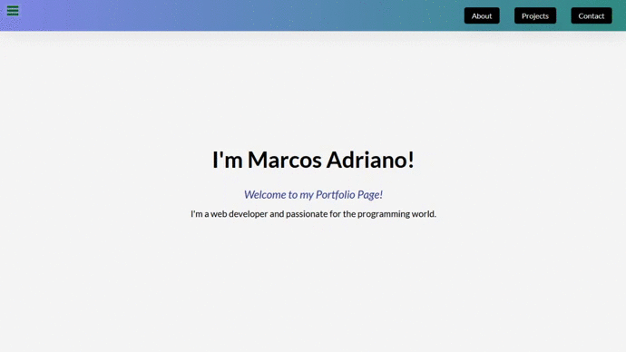
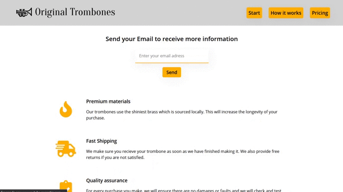
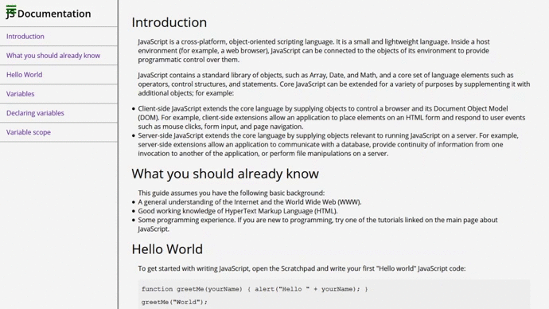

# :boom: Responsive Web Design

## :mag_right: Overview

This repositiry was created to [freeCodeCamp](https://www.freecodecamp.org/) course Responsive Web Design where some projects needed to be made to obtain the certificate.

## :computer: Projects

### :raising_hand: Personal Portfolio Webpage

  

### :page_facing_up: Product Landing Page

  

### :memo: Survey Form

  

### :information_source: Technical Documentation Page

  

### :name_badge: Tribute Page

  

## :rocket: Technologies

- HTML
- CSS

## :unlock: License

MIT

---

Made by:

<table>
  <tr>
  <td align="center"> <b><a href="https://linkedin.com/in/marcosadriano05" title="Marcos">Marcos Adriano</a></b> Web Developer</td>
  </tr>
</table>

#NeverStopLearning